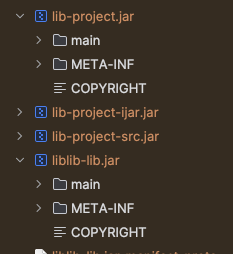
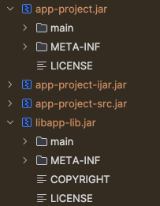
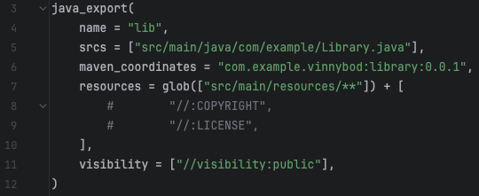

## Bazel Java Example - resources not appearing in `-project.jar` file

## Background

This is an example of an issue that occurs when trying to add the same file to every `java_export` jar such as a `LICENSE` file.
The example is two java exports - a "library" (`lib`) and an "app" (`app`) that depends on the library.

The library has a `COPYRIGHT` file that is added as a resource.
The app depends on the library and has a `COPYRIGHT` and a `LICENSE` file that is added as a resource.

## Reproduction

First build the repo using `bazel build //...`

For the library, we can observe that the `liblib-lib.jar` and the `lib-project.jar` contain the `COPYRIGHT` file as expected.

For the app, we can observe that the `libapp-lib.jar` contains the `COPYRIGHT` and `LICENSE` files as expected.
However, the `app-project.jar` only contains the `LICENSE` file and not the `COPYRIGHT` file.

We can also observe that when `COPYRIGHT` is removed from `//lib:lib` as a resource, it will appear in the `app-project.jar` file, 
suggesting that the issue is due to the same file being added to both jars.

## Swapping configurations

I have also tested with two other configurations:

Having `//app:app` depend on `//lib:lib-lib` instead of `//lib:lib`. The results were the same.

Swapping `//lib:lib` for a `java_library` rule instead of a `java_export` rule. This actually did fix the problem, 
leading me to believe this might be a bug in `rules_jvm_external` since `java_export` is expected to be a drop-in replacement for `java_library`.
